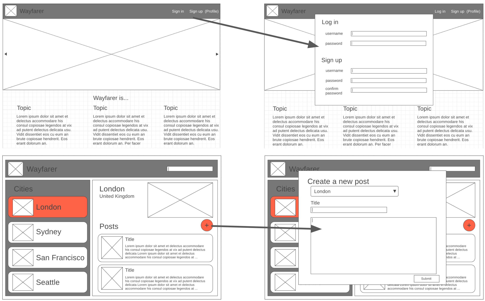

# Project Wayfarer
This project is about an example about job in real life. The client, Instructor, has provided basic wireframes and user stories. In some cases, these requirements may be vague or incomplete.

## About
- A travel community for users to share city-specific tips ("posts" or "logs") about their favorite locations around the world. I created this with 3 contributing developers in one week. The majority of this project was front-end and back-end at the same time. Our team switched roles often to finish every requirement of the project. 

- In this project, my job is taking care about back-end ( connect database with front-end, Routes ), front-end ( Sign-in, up and all validation mostly ). After that we was pairing programming together.

## Wireframes


## User Stories
https://git.generalassemb.ly/sf-sei-5/project-02/blob/master/user-stories.md


## See My Projects
https://project-wayfarer3.herokuapp.com/

## Example Account
Use below information to log-in example account

#### Email: ```guest@gmail.com```
#### password: guest

### Technologies used
React, Express, Node js, Mongoose, JavaScript, BootStrap, HTML/CSS
